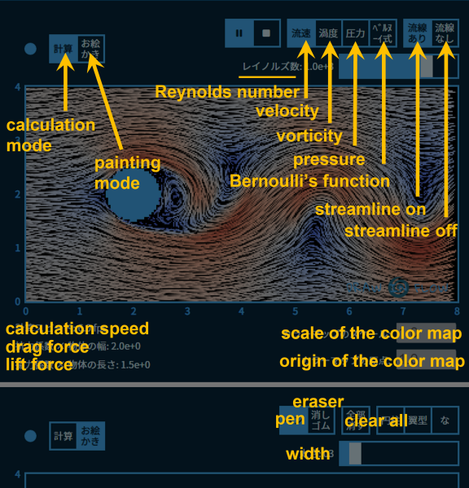

 

# What is this repositry?
 Source codes of WASM/JS web application "Draw in Flow", which can calculate 2D flow around object using the lattice Boltzmann method. Physical boundary can be freely painted and set by user. It is published on the following webpage:

https://solarphys.com/draw_in_flow/

If you like, please retweet the following tweets to spread the word:

<blockquote class="twitter-tweet">
2次元流体計算をブラウザに計算させるウェブアプリを作りました。格子ボルツマン法を用いています。ユーザーが自由に描いた物体を一様流中に置いて、流れの様子を見守ることができます。 いろいろイジって遊んでください。 <a href="https://twitter.com/hashtag/draw_in_flow?src=hash&amp;ref_src=twsrc%5Etfw">#draw_in_flow</a><a href="https://t.co/5mac8evgHF">https://t.co/5mac8evgHF</a> <a href="https://t.co/IXq6slXEnh">pic.twitter.com/IXq6slXEnh</a>
&mdash; みね@太陽の科学館 (@solarphys_info) <a href="https://twitter.com/solarphys_info/status/1626054485335482368?ref_src=twsrc%5Etfw">February 16, 2023</a></blockquote>

The following Qiita article summarizes the memoirs of the development of the app:

[URL to be added]

# How to play the app?

The application is written in Japanese. The English translations of the main buttons are as follows:

 

The description of the application can be translated using the browser's automatic translation function.

# What files are included?

+ Directory ``www/``: The HTML and CSS for the application and the JavaScript file for the main program are located here. The UI and painting mode are implemented by JS.
+ Directory ``src/``: Rust code to be compiled to WebAssembly is located here. CFD computation and visualization are implemented by WASM.